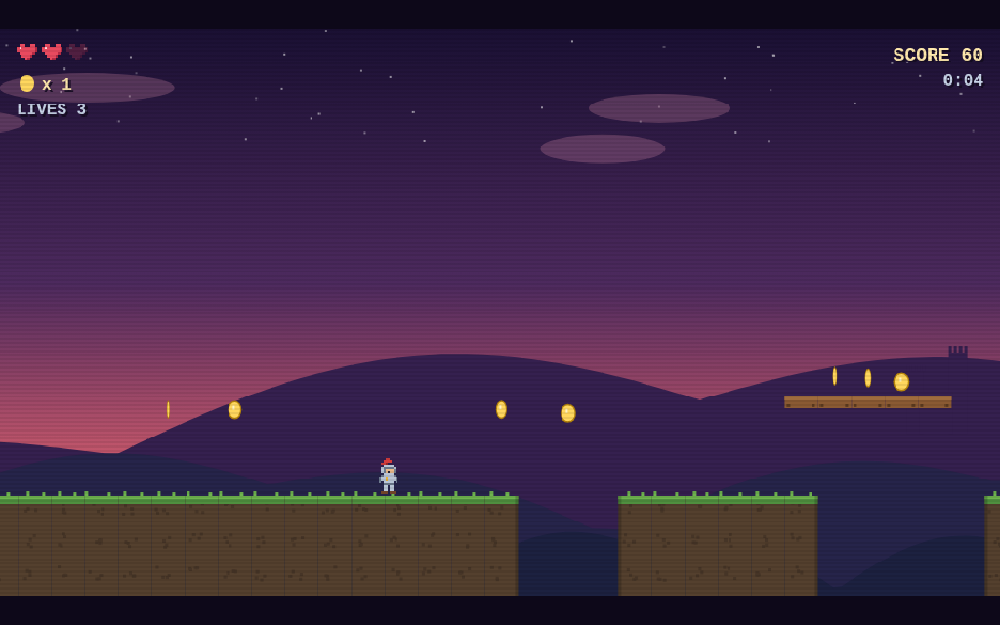
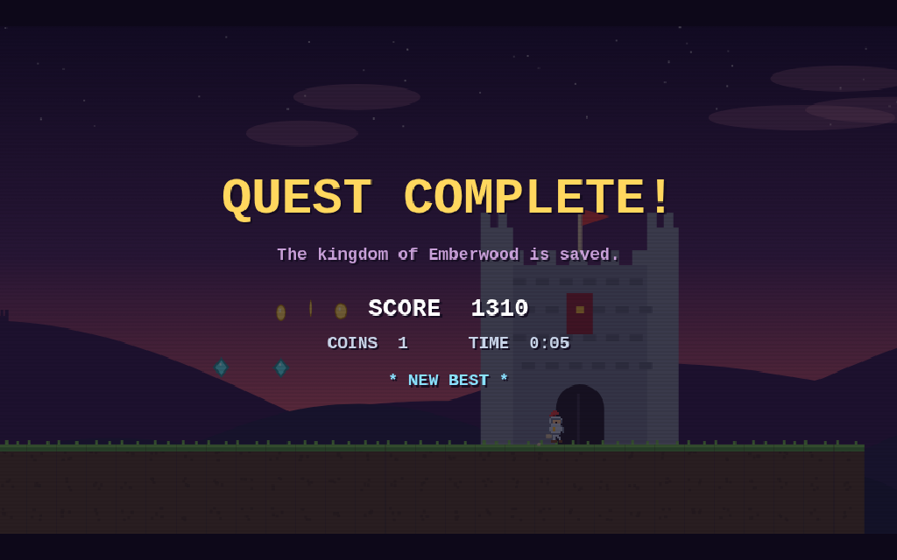

# ⚔️ Emberwood Quest

*A tale of the fallen kingdom* — a nostalgic, fantasy side-scroller that runs
in a single HTML file. No build step, no dependencies, no assets to download.
Just open it and play.


## Play

Open `index.html` in any modern browser. That's it.

```
open index.html        # macOS
xdg-open index.html    # Linux
start index.html       # Windows
```

Or serve it (avoids any local-file quirks):

```
python3 -m http.server 8000
# then visit http://localhost:8000
```

## Controls

| Action | Keys |
|--------|------|
| Move   | ← → or A / D |
| Jump   | ↑ / W / Space / Z (hold for higher jumps) |
| Sword  | X / J / K |
| Start / restart | Enter |
| Pause  | P |
| Music on/off | M |

Touch controls appear automatically on mobile.

## The quest

Fight your way through 8 hand-built screens of the Emberwood — meadows, stone
towers, spike alleys, a bone arena, and a final ascent to the castle gates.



- 🪙 **49 coins** and 💎 **3 gems** to collect
- 🟢 Slimes, 🦇 bats, and 💀 skeletons — stomp them Mario-style or cut them down with your sword
- ⚑ **Checkpoints** so death doesn't send you all the way back
- ❤️ 3 hearts, 3 lives, and one hidden heart pickup high above the ascent
- 🏰 Reach the castle gates to save the kingdom (bonus points for leftover lives)



## Under the hood

Everything is hand-rolled in vanilla JS on a `<canvas>`:

- **Pixel-art sprites** defined as string grids and scaled up (crisp `image-rendering: pixelated`)
- **Tile-based level** authored as ASCII maps — edit the `SEGS` array in `index.html` to build your own screens
- **Proper platformer feel**: coyote time, jump buffering, variable jump height, one-way platforms
- **WebAudio chiptune**: a looping A-minor melody plus bleepy sound effects, all synthesized — zero audio files
- **Parallax dusk sky** with drifting clouds, twinkling stars, and a distant castle silhouette
- CRT scanline overlay for maximum nostalgia

Best score is saved to `localStorage`.
