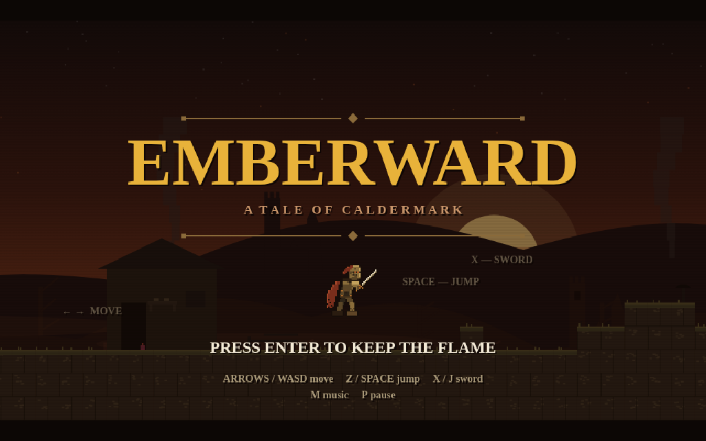
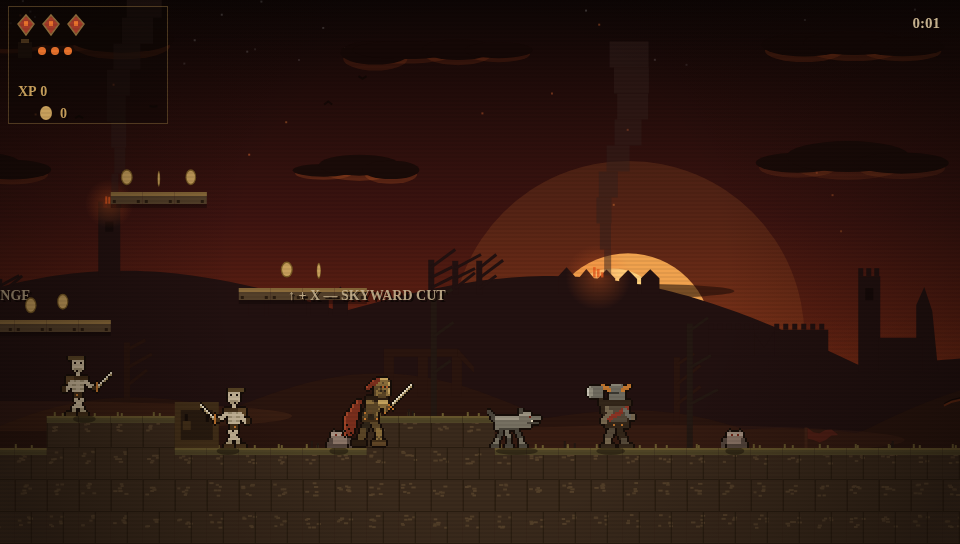
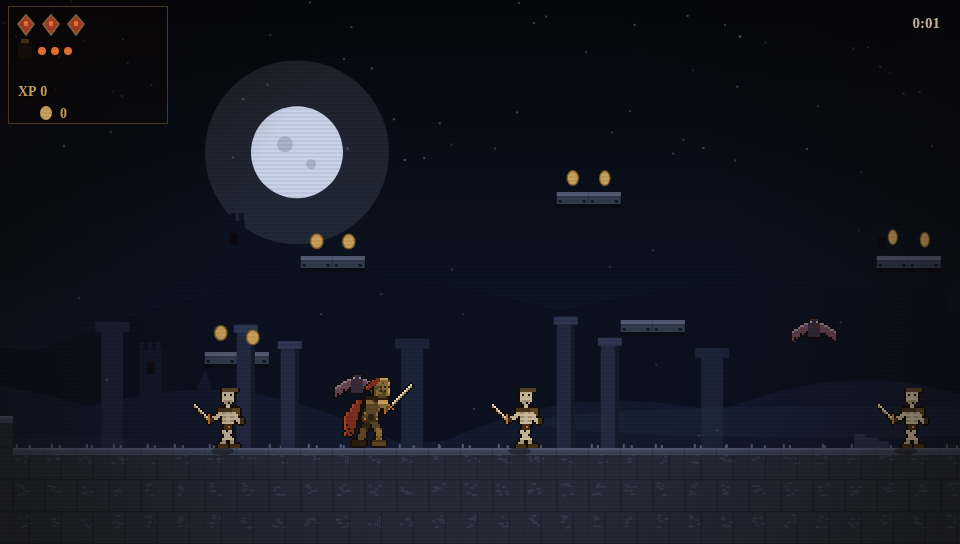
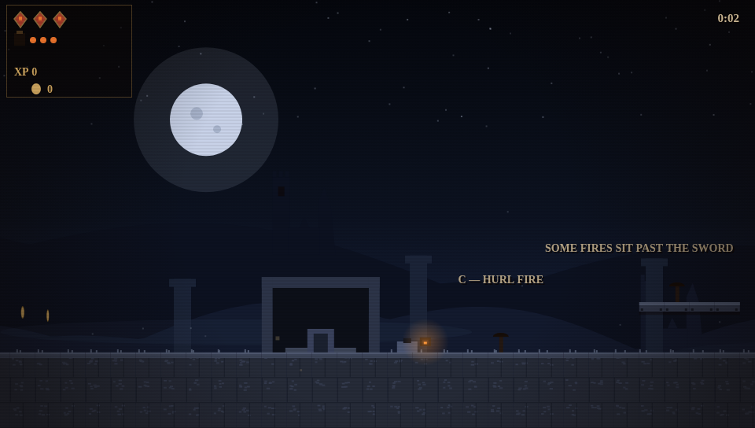

# 🔥 EMBERWARD

*A Tale of Caldermark* — a gritty retro side-scroller in a single HTML file.
No build step, no dependencies, no assets. Open it and play.

> When the Ember Warden of Caldermark stopped tending the King's hearth and let it
> feed on him, the fire that had warmed a kingdom walked out its gates and consumed it.
> One knight survived, hearthless, with an empty lantern and a sword named Brand.



## Play

Open `index.html` in any modern browser, or serve it:

```
python3 -m http.server 8000   # then visit http://localhost:8000
```

## Controls

| Action | Keys |
|--------|------|
| Move   | ← → or A / D |
| Jump   | ↑ / W / Space / Z (hold for height) |
| Sword  | X / J / K |
| Rising Strike | hold jump + X on the ground — leap with an upward cut |
| Skyward Cut | ↑ + X — slash overhead, standing or mid-jump; the answer to anything above you |
| Plunging Strike | ↓ + X in the air — dive blade-first; bounces you higher than a jump off a kill. Hold ↓ to pogo-chain |
| Hurl fire | C / L *(unlocked at the Cold Hearth, midway through Act II)* |
| Start  | Enter · Pause P · Music M |

On mobile a gamepad appears in the rails beside the game: a d-pad under the
left thumb (slide for diagonals — ▲/▼ are the strike modifiers) and
jump / strike face buttons under the right, joined by a 🔥 button once fire
is unlocked. A pause button sits top-right; pausing offers
continue / quit to title (also navigable with ↑↓ + Enter).

## Act I — The Ash Harvest

March east through razed Caldermark: the farmhouse with the meal still on the
table, the burned scarecrow pointing the way, the dead orchard, the mill still
turning with one sail aflame. Eight screens, ending at a shrine where one stone
is still warm.



- **The horde:** Bone Levies (fodder), Ash Hounds (big ash-grey farm dogs that
  spring into a charge — jump or cut), Ash Imps (small, erratic hoppers — worth
  double a levy if you can hit one), Iron Brigands (three hits; bait the
  telegraphed swing — and at range they hurl spinning axes you can bat out of
  the air). No two beasts patrol at quite the same tempo.
- **Critical hits — "The Blade Catches":** pick up the soldier's fire-steel at
  the horde campfire and from then on roughly one strike in twenty ignites,
  dealing double damage and burning the foe to ash on the spot
- **Checkpoints:** dark torches along the road — walk up and light one
  (`TENDED.`) to set your respawn and refill hearts, lives, and fire
- **Kill chains** (DOUBLE! TRIPLE! RAMPAGE!), corpse-launch kill pops, hitstop,
  and a quiet HUD: ember-diamond hearts, three coals in the lantern, XP
- **Aerial combat pays**: airborne kills earn +50% XP, and the plunge pogo-chains
  through packs — dive perches are built over the campfire arena for exactly that
- **The high road pays**: optional platform detours above the main path hold
  the rewards — a 3-jump chain to a healing ember above the scarecrow field, a
  skyway over the mill ravine (the act's one lethal drop), treetop coin tiers,
  and secret braziers you slash alight
- **SPARK:** enough XP and the hero visibly transforms — slow-mo, converging
  embers, a shockwave — first stage of Spark → Kindled → Ablaze
- **Grade card** at the act's end: time, the fallen, coals spent, best chain → D–S

## Act II — The Cold Hearth

The castle the fire walked out of, under a bone moon. Eight screens: the
gatehouse doors torn *outward*, the roofless great hall, the stripped armory
with floors that give way underfoot, the spiral stair, and the Cold Hearth
itself — where the game quietly explains the empty lantern, and Brand drinks
the Warden's Coal.



- **Cinder Wraiths** float out of sword reach and swoop — the Skyward Cut and
  Rising Strike are their answer
- **Ember Cultists** lob fire from ledges; hurl fire back, or parry the lob
  out of the air with a slash
- **The Warden's Coal:** here Brand gains fire. Fireballs crack open armored
  Brigands, pass through lesser foes, and light braziers the sword can't
  reach. You carry up to three charges (Embers, shown as flame pips on the
  HUD sword); every five sword hits earns one back, and checkpoints refill
  them all
- **Traps:** collapsing floors, swinging censers over pits
- The story's reveal is told exactly once — two quiet cards when the hero
  kneels at the stone before the dead hearth — so don't skim it. And at the
  act's end, from the broken east wall, look at the far rampart in the war
  camp's glow: that small ember-lit silhouette is your only glimpse of the
  villain before Act III.



Act III (The Hungry Light) — the war camp, the full-roster gauntlet, and
Selwyn the Warm — is speced in [STORYBOARD.md](STORYBOARD.md) and coming next.

## Under the hood

- Vanilla JS on one `<canvas>`, fixed 60fps timestep
- **Procedural pixel sprites**: painted shaded regions, auto-outlined, dither
  textured — the hero has 5 poses × 4 transformation stages, all generated
- Game-feel per a design consult: 4-frame hitstop, 9 on crits, weighted crit odds
  with a pity timer, particle and shake budgets, corpse physics
- WebAudio synth for everything, with an **adaptive score** (designed with an
  8/16-bit chiptune consult): the somber D-minor base loop never changes, but
  each transformation stage adds a layer — a heartbeat at SPARK, a rolling
  arpeggio at KINDLED, an octave gallop with drums at ABLAZE — and Act II
  moves the whole song to G minor over a lament bass with a dead chapel bell.
  Crit ring-outs, chain pitch escalation
- Much of the story is told through set dressing rather than text. One thread
  to watch: every roadside shrine has a pair of iron lantern brackets, and one
  of them is always empty — the game explains why at the Cold Hearth
